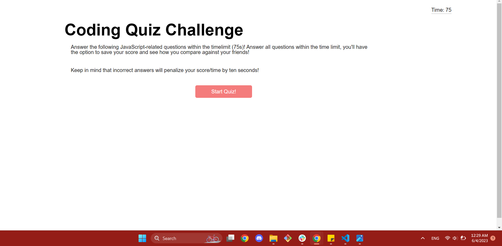
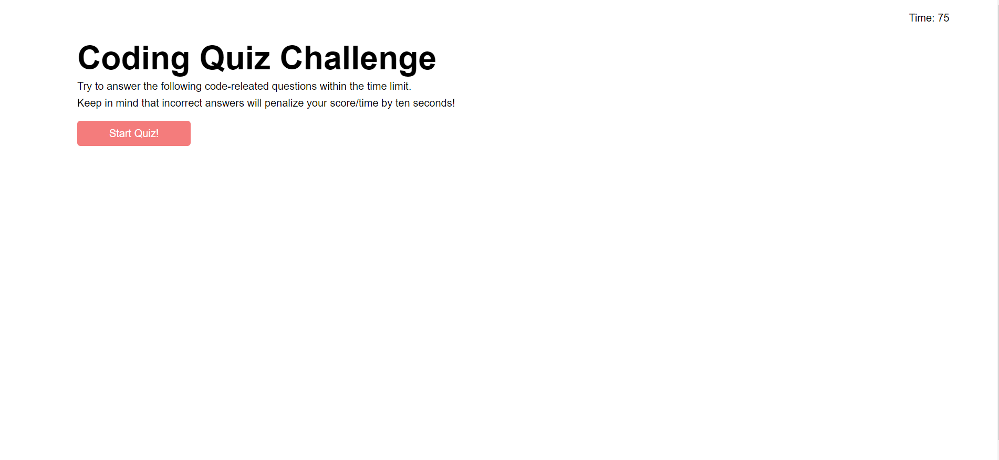

# JavaScript Quiz Game []

## Description 

This webpage uses basic HTML, CSS, and JavaScript to allow a user to navagate through a quiz on JavaScript basics. Upon going to the [application's URL](https://anna-dxj.github.io/md4-quiz-game/), the user will be greeted with the title page of the quiz: 

Upon clicking the start button, the timer will begin to count down, giving the user a total of 75 seconds to answer all questions. The user will also be presented with the initial question, which upon answer, the user will be faced with feedback and penalty if they answered incorrectly. Questions after the initial question should look like this: [!Screenshot-sample-question](assets/image/sample-question.png)

 Once a user answers all questions or the clock runs out before they are able, they will be presented with the ending screen, which will include their final score, an option to save their score (identifying themselves by user-input initials), and previous saved scores. Saved scores uses local storage, so scores will not persist across browsers, but will persist across sessions (ie. scores won't be seen across Safari and Chrome, but can be seen across different Chrome sessions). Users will have the ability to clear local storage as well. This should look like the following: [!Screenshot-scores-page](assets/image/scores)

By finishing this project, I was able to perfect JavaScript basics and practice using Local Storage, navigating the DOM, and JavaScript organization.

---
## Table of Contents

  - [Installation](#instlalation)
  - [Usage](#usage)
  - [License](#license) 
  - [Contributing](#contributing)
  - [Tests](#tests)

---

## Installation

There are no installation instructions to continue development or to use this application.

## Usage

To navigate to this webpage, please [click here](https://anna-dxj.github.io/md4-quiz-game/). The website should appear like the screenshot below: 

To access Chrome DevTools, access the webpage from Google Chrome and press Command+Option+I (MacOS) or Control+Shift+I (Windows). A console will appear on teh webpage, and you may inspect the structure of the webpage through the console. 

## License

  [License: MIT](https://opensource.org/licenses/MIT)

  Copyright 2023 Anna Langford

Permission is hereby granted, free of charge, to any person obtaining a copy
of this software and associated documentation files (the "Software"), to deal
in the Software without restriction, including without limitation the rights
to use, copy, modify, merge, publish, distribute, sublicense, and/or sell
copies of the Software, and to permit persons to whom the Software is
furnished to do so, subject to the following conditions:

The above copyright notice and this permission notice shall be included in all
copies or substantial portions of the Software.

THE SOFTWARE IS PROVIDED "AS IS", WITHOUT WARRANTY OF ANY KIND, EXPRESS OR
IMPLIED, INCLUDING BUT NOT LIMITED TO THE WARRANTIES OF MERCHANTABILITY,
FITNESS FOR A PARTICULAR PURPOSE AND NONINFRINGEMENT. IN NO EVENT SHALL THE
AUTHORS OR COPYRIGHT HOLDERS BE LIABLE FOR ANY CLAIM, DAMAGES OR OTHER
LIABILITY, WHETHER IN AN ACTION OF CONTRACT, TORT OR OTHERWISE, ARISING FROM,
OUT OF OR IN CONNECTION WITH THE SOFTWARE OR THE USE OR OTHER DEALINGS IN THE
SOFTWARE.

## Contributing

Tutor Alexis Gonzalez was consulted and helped in clarifying how to navagate using Local Storage. 

To help with shuffling through questions and to ensure that the correct answer was given the TRUE value, [this YouTube video](https://www.youtube.com/watch?v=riDzcEQbX6k&ab_channel=WebDevSimplified) was consulted, particularly starting from [12:30](https://youtu.be/riDzcEQbX6k?t=750). 

## Tests
This application has no tests. 