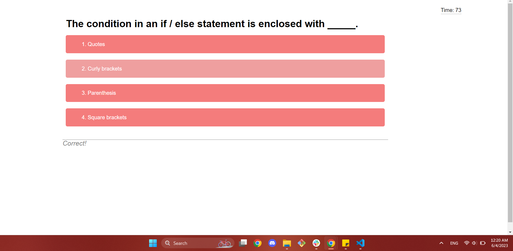
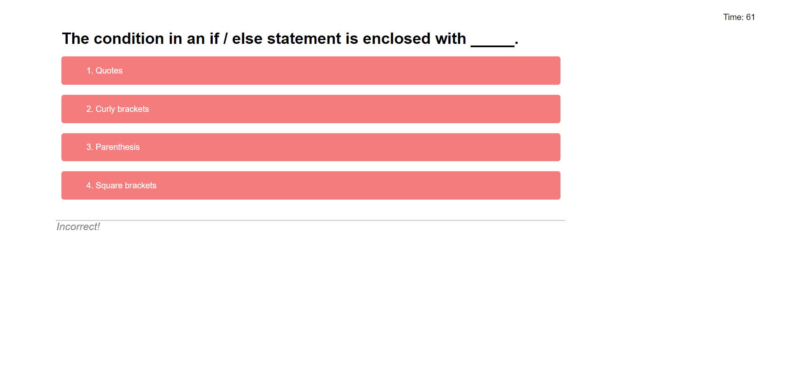
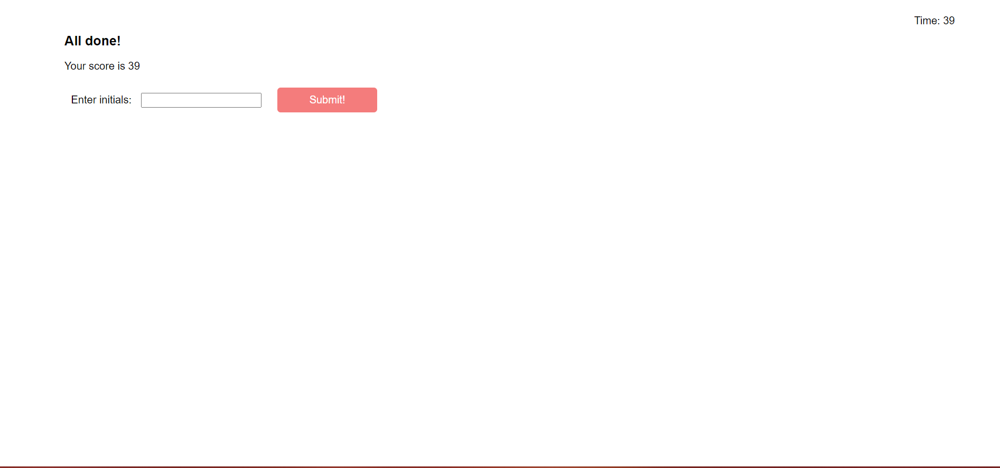
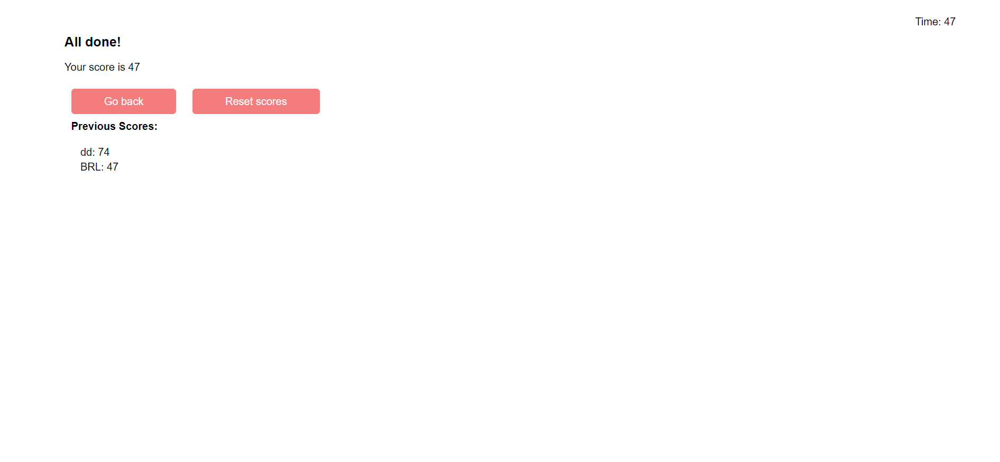

# JavaScript Quiz Game

## Description 

This webpage uses JavaScript to allow a user to navagate through a quiz on JavaScript basics. Upon going to the application's URL, the user will be greeted with the title page of the quiz: 

Upon clicking the start button, the clock will begin to count down, giving the user a total of 75 seconds to answer all questions. The user will also be presented with the initial question, which should look like the following: 

 Upon answering any question, the quiz will automatically move onto the next question. At the bottom of the page, the quiz will give the user feedback as to whether the previous question was answered correctly or incorrectly. If answered incorrectly, ten second's time will be deducted from the clock. The feedback will look like either of the following: 
  
 

After completing the quiz, the user will be confronted with the final screen which includes a form for the user to input their initials, and their final score, which corresponds to their remaining time: 

Upon submitting, the user will be able to see previous scores, and have the option to play again, or to reset all scores: 

If the user chooses to play again, they will be brought back to the title page. If the user chooses to reset the score board, they will be encouraged with a message to take the quiz again to start recording scores again: 

By finishing this project, I was able to perfect JavaScript basics and practice using Local Storage, navigating the DOM, and JavaScript organization.

---
## Table of Contents

- [Installation](#installation)
- [Usage](#usage)
- [Credits](#credits)
- [License](#license)

---

## Installation

N/A

## Usage

To navigate to this webpage, please [click here](https://anna-dxj.github.io/md4-quiz-game/). The website should appear like the screenshot below: 

To access Chrome DevTools, access the webpage from Google Chrome and press Command+Option+I (MacOS) or Control+Shift+I (Windows). A console will appear on teh webpage, and you may inspect the structure of the webpage through the console. 

## Credits

Tutor Alexis Gonzalez was consulted and helped in clarifying how to navagate using Local Storage. 

To help with shuffling through questions and to ensure that the correct answer was given the TRUE value, [this YouTube video](https://www.youtube.com/watch?v=riDzcEQbX6k&ab_channel=WebDevSimplified) was consulted, particularly starting from [12:30](https://youtu.be/riDzcEQbX6k?t=750). 

## License

MIT License

Copyright (c) [2023] [Anna Langford]

Permission is hereby granted, free of charge, to any person obtaining a copy
of this software and associated documentation files (the "Software"), to deal
in the Software without restriction, including without limitation the rights
to use, copy, modify, merge, publish, distribute, sublicense, and/or sell
copies of the Software, and to permit persons to whom the Software is
furnished to do so, subject to the following conditions:

The above copyright notice and this permission notice shall be included in all
copies or substantial portions of the Software.

THE SOFTWARE IS PROVIDED "AS IS", WITHOUT WARRANTY OF ANY KIND, EXPRESS OR
IMPLIED, INCLUDING BUT NOT LIMITED TO THE WARRANTIES OF MERCHANTABILITY,
FITNESS FOR A PARTICULAR PURPOSE AND NONINFRINGEMENT. IN NO EVENT SHALL THE
AUTHORS OR COPYRIGHT HOLDERS BE LIABLE FOR ANY CLAIM, DAMAGES OR OTHER
LIABILITY, WHETHER IN AN ACTION OF CONTRACT, TORT OR OTHERWISE, ARISING FROM,
OUT OF OR IN CONNECTION WITH THE SOFTWARE OR THE USE OR OTHER DEALINGS IN THE
SOFTWARE.